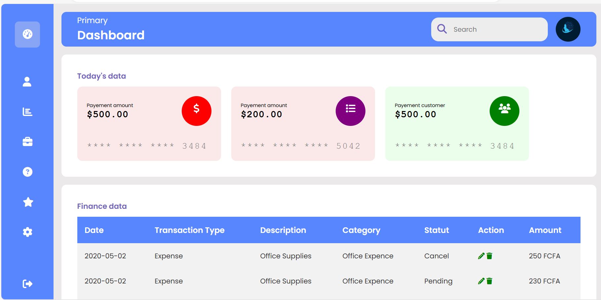

# Responsive Dashboard

This project showcases a simple and responsive dashboard created using HTML, CSS, and the Poppins font from Google Fonts. The dashboard includes elements such as a sidebar with navigation links, information cards, and a financial table.

## Preview



## Project Contents

- **index.html**: The main HTML file containing the structure of the dashboard.
- **style.css**: The CSS file defining the style and layout of the dashboard.

## Features

1. **Responsive Sidebar**
   - The sidebar expands on hover to reveal more information.
   - Navigation links with icons for different sections of the dashboard.

2. **Main Section**
   - Main title with a profile image and a search box.
   - Information cards displaying today's data.

3. **Information Cards**
   - Colored cards representing various financial information.
   - Hover effect to draw attention to each card.

4. **Financial Table**
   - Table displaying financial data with edit and delete buttons.
   - Total transactions are displayed in the bottom row.

## How to Use

1. Clone this repository to your local machine.
   ```bash
   git clone https://github.com/Schosmiel/Financial-dashboard.git
